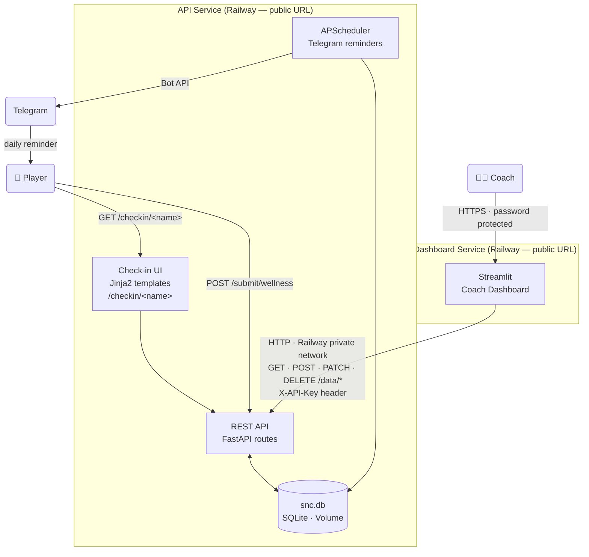

# S&C Dashboard

A cricket team strength & conditioning dashboard built with FastAPI + Streamlit, deployed on Railway.

Built this for my friend who is a Strength and Conditioning coach for Nalgonda Knights in Telangana T20 Premier League - [TG20](https://tg20.org/).

---

## Table of Contents

- [Dashboard Panels](#dashboard-panels)
  - [Team Overview](#team-overview)
  - [Load Monitor](#load-monitor)
  - [Player Profiles](#player-profiles)
  - [Admin](#admin)
  - [Raw Data](#raw-data)
- [Architecture](#architecture)
- [Local Development](#local-development)
- [Deploying to Railway](#deploying-to-railway)
- [Making Changes](#making-changes)
- [Troubleshooting](#troubleshooting)
- [Adding Session RPE and Bowling Data](#adding-session-rpe-and-bowling-data)

---

## Dashboard Panels

The dashboard is split into five tabs:

### Team Overview
A coach-at-a-glance view updated in real time.

| Panel | What it shows |
|-------|---------------|
| **Compliance Banner** | Top-of-page strip showing today's morning check-in rate, evening check-in rate, and combined submission rate across the full squad |
| **Team Availability** | Donut chart: how many players are Fully Available, Modified, Rehab, or haven't submitted today's check-in |
| **Fast Bowlers Status** | Table of fast bowlers — bowling days in the last 7 days and dominant intensity (Low / Moderate / High) |
| **Readiness Scores** | Three metric cards (Green / Yellow / Red) counting players by readiness band for a selected date. Score = Sleep + Energy + (6 − Soreness), max 15; Green ≥ 13, Yellow 10–12, Red < 10 |
| **Top Concerns** | Up to 5 players flagged today for tightness, low sleep/energy, high soreness, or a non-available self-report |
| **Wellness Check-in Submitted** | Count of today's submissions vs squad size, with a dropdown listing who hasn't submitted yet |
| **Squad ACWR** | Horizontal bar chart of every player's acute:chronic workload ratio, colour-coded by risk band (Undertraining / Optimal / Caution / High Risk) |
| **Check-in Compliance** | Historical submission rate chart — morning, evening, or combined — over a selectable date range |

### Load Monitor
Per-player training load analysis. Select a player from the dropdown.

| Panel | What it shows |
|-------|---------------|
| **Session Load metrics** | Cards for sessions this week, 7-day avg RPE, 7-day total load (AU = duration × RPE), and ACWR (7-day acute / 28-day chronic) with Undertraining / Optimal / Caution / High Risk label |
| **28-Day Load Trend** | Bar chart of daily load in AU, color-coded green (< 200) / amber (200–400) / red (> 400) |
| **Weekly ACWR Trend** | Line chart of ACWR over recent weeks with risk-band reference lines |
| **Session Type Breakdown** | Donut chart splitting sessions across Training, Match, Gym, Recovery, Rehab |
| **RPE Distribution** | Bar chart of how often each RPE value (1–10) has been logged |
| **Bowling Load** *(fast bowlers only)* | Bowling days and dominant intensity this week, plus a 28-day intensity timeline (Low / Moderate / High) |

### Player Profiles
Full profile card for a selected player.

| Panel | What it shows |
|-------|---------------|
| **Status banner** | Color-coded pill: Full Training / Modified / Recovery / Rehab / Unavailable |
| **Player Profile** | Age, role, batting/bowling style, dominant side, fast-bowler flag, contact, injury history, status notes |
| **Latest Wellness** | Readiness score out of 15 and a radar chart (Sleep, Energy, Soreness) from the most recent check-in |
| **7-Day Wellness Trend** | Line chart of daily Sleep, Energy, and Soreness values over the last 7 days |
| **Readiness Score Trend** | Line chart of the composite readiness score with Green/Yellow/Red background bands |

### Admin
Roster and data management (coach only).

| Panel | What it shows |
|-------|---------------|
| **Roster Management** | Editable table — add/edit players (name, role, styles, age, status, injury history) |
| **Player Check-in Links** | Pre-built personal check-in URLs to share with each player |
| **Export Data** | CSV download buttons for wellness, sessions, evening check-ins, and roster |
| **Reminder Settings** | Configure and manually trigger morning/evening Telegram reminder times without redeploying |

### Raw Data
Filterable, exportable tables for every data source: Morning Check-ins, Evening Check-ins, Session Load, Bowling Check-ins, and Roster. Each row has an **Edit** button that opens a dialog to correct values in place (PATCH to the API — no delete/re-insert needed).

---

## Architecture

There are three logical components but only **two deployed services**:

| Logical component | Deployed as | Who uses it |
|-------------------|-------------|-------------|
| **Player check-in UI** | Part of the API service (Jinja2 templates served by FastAPI) | Players (public, no login) |
| **REST API** | Part of the API service | Dashboard + check-in UI |
| **Coach dashboard** | Separate Streamlit service | Coaches (password protected) |



```
api/                     FastAPI — REST API + player check-in UI (two logical roles, one service)
  main.py
  notifications.py       APScheduler + Telegram reminder logic
  templates/
    checkin.html         Player check-in form (open, no login required)
  requirements.txt
  Dockerfile

dashboard/               Streamlit — coach dashboard (password protected)
  app.py
  .streamlit/
    config.toml
  requirements.txt
  Dockerfile

data/                    SQLite database (Railway stores this on a Volume)
  snc.db                 four tables: wellness, sessions, evening, roster

.env.example             Copy to .env for local dev
```

**Data flow:**
```
Player opens /checkin/<their-name>  (served by FastAPI, no login)
        ↓
Selects name → fills sliders → submits
        ↓
POST /submit/wellness → row inserted into snc.db (on the API's Volume)
        ↓
Coach opens Streamlit dashboard (password protected)
        ↓
Dashboard calls the API over HTTP (GET /data/*, PATCH /data/*, etc.) → renders charts
```

> The database lives **only** on the API service. The dashboard never touches
> the Volume directly — it reads and writes through the API over HTTP (`API_URL`).

**Two URLs in production:**
- `https://your-api.railway.app/checkin/<player-name>` → per-player check-in link (share from the Admin tab)
- `https://your-dashboard.railway.app` → coach dashboard (password protected)

### Current limitation — check-in UI and REST API share one service

The player-facing check-in form is bundled with the API because it was the simplest
deployment path: one Railway service, one Volume, one Dockerfile. This means any
change to the check-in UI (template tweaks, new form fields) requires redeploying
the same service that handles all API traffic.

> **Phase 2** will split these into three independent services — a dedicated
> check-in UI service, the REST API, and the dashboard — so each can be scaled,
> deployed, and iterated on independently. This is not in scope yet.

---

## Local Development

### Prerequisites

- Python 3.12+
- [uv](https://docs.astral.sh/uv/getting-started/installation/) (`curl -LsSf https://astral.sh/uv/install.sh | sh`)
- Two terminal windows (one for each service)

### Setup

```bash
# Clone the repo
git clone https://github.com/YOUR_USERNAME/snc-dashboard.git
cd snc-dashboard

# Create venv and install all dependencies (run once)
uv sync

# Copy env file
cp .env.example .env
# Edit .env and set DASHBOARD_PASSWORD to whatever you want
```

### Run the API (check-in form)

```bash
uv run uvicorn api.main:app --reload --port 8000
```

The bare `http://localhost:8000/checkin` shows a "use your personal link" page — players
need their own `http://localhost:8000/checkin/<name>` link (grab them from the Admin tab).

### Run the Dashboard

```bash
uv run streamlit run dashboard/app.py
```

Dashboard available at: http://localhost:8501

> `DATA_DIR` points the API at the local `data/` folder (created automatically on first
> run), where it keeps `snc.db`. The dashboard reads from the API via `API_URL`
> (defaults to `http://localhost:8000`) — it does **not** open the database directly.

### First run

1. Open the dashboard at http://localhost:8501
2. Log in with the password you set in `.env`
3. Go to the **Admin** tab → add your players → click **Save Roster**
4. In **Admin → Player Check-in Links**, copy a player's personal link and open it — they'll appear pre-selected

---

## Deploying to Railway

Railway runs two separate services: the **API** (FastAPI), which owns the SQLite database
on a persistent Volume, and the **Dashboard** (Streamlit), which talks to the API over
Railway's private network. Only the API mounts the Volume.

### Step 1 — Push code to GitHub

```bash
git add .
git commit -m "initial commit"
git remote add origin https://github.com/YOUR_USERNAME/snc-dashboard.git
git push -u origin main
```

### Step 2 — Create a Railway project

1. Go to [railway.app](https://railway.app) and sign in with GitHub
2. Click **New Project → Deploy from GitHub repo**
3. Select your `snc-dashboard` repository

### Step 3 — Configure the API service

Railway will create one service by default. Configure it as the API:

1. Click on the service → **Settings**
2. Leave **Root Directory** blank (build context is the repo root)
3. Set **Dockerfile Path** to `api/Dockerfile`
4. Under **Networking → Expose port**: set to `8000`
5. Click **Generate Domain** to get a public URL (this is your check-in base URL)
6. Under **Settings → Deploy → Healthcheck Path**: set to `/health`
   (otherwise Railway probes `/`, which redirects — point it at the real probe)

### Step 4 — Add the Dashboard service

1. In your Railway project → click **New → GitHub Repo** (same repo)
2. Click on the new service → **Settings**
3. Leave **Root Directory** blank (build context is the repo root)
4. Set **Dockerfile Path** to `dashboard/Dockerfile`
5. Under **Networking → Expose port**: set to `8501`
6. Click **Generate Domain** to get a public URL (this is your dashboard URL)

### Step 5 — Create the Volume (API service only)

The SQLite database must live on a persistent Volume so it survives redeploys.
Attach it to the **API service only** — SQLite is a single-writer file and the
dashboard reaches the data through the API, not the disk.

1. In your Railway project → click **New → Volume**
2. Name it `snc-data`
3. **Attach it to the API service**:
   - Click the API service → **Volumes** tab
   - Select `snc-data` → Mount path: `/data`

### Step 6 — Set environment variables

**API service:**

| Variable | Value | Notes |
|----------|-------|-------|
| `DATA_DIR` | `/data` | Must match the Volume mount path |
| `INTERNAL_API_KEY` | *(random hex)* | Shared secret for admin/mutating endpoints. Generate: `python -c "import secrets; print(secrets.token_hex(32))"` |
| `TELEGRAM_BOT_TOKEN` | *(from @BotFather)* | Optional — enables morning/evening player reminders |
| `TZ` | `Asia/Kolkata` | Scheduler timezone for reminders |

**Dashboard service:**

| Variable | Value | Notes |
|----------|-------|-------|
| `DASHBOARD_PASSWORD` | `YourSecretPassword` | Coach login password |
| `API_URL` | `http://<api-service>.railway.internal:8000` | Private URL of the API service (no public traffic) |
| `PUBLIC_URL` | `https://your-api.railway.app` | API's public domain — used to build player check-in links |
| `INTERNAL_API_KEY` | *(same as API service)* | Must match the API service value |

To set variables:
- Click the service → **Variables** tab → **New Variable**

After adding variables, Railway will automatically redeploy the affected services.

### Step 7 — Verify deployment

1. Open `https://your-api.railway.app/health` — you should see `{"status":"ok"}`
2. Open `https://your-dashboard.railway.app` — you should see the login screen
3. Log in, go to **Admin**, add your players, click **Save Roster**
4. In **Admin → Player Check-in Links**, open a player's link — they should appear pre-selected

### Step 8 — Share with players

Send each player their **personal** check-in link (from **Admin → Player Check-in Links**) and ask them to bookmark it:
- iPhone: Safari → Share → **Add to Home Screen**
- Android: Chrome → menu (⋮) → **Add to Home Screen**

It appears as an app icon on their phone. One tap → select name → submit.

---

## Making changes

Any push to `main` triggers an automatic redeploy on Railway:

```bash
git add .
git commit -m "describe what you changed"
git push
```

---

## Troubleshooting

**Check-in form shows "No players in roster yet"**
→ Log into the dashboard → Admin tab → add players → Save Roster.
The check-in form reads the roster from the API at page load time.

**Dashboard login always fails**
→ Check that `DASHBOARD_PASSWORD` is set correctly on the dashboard service in Railway (no extra spaces).
→ Trigger a manual redeploy after updating env vars.

**Dashboard shows "Could not reach API" / all panels empty**
→ Check that `API_URL` on the dashboard service points at the API's private hostname
   (`http://<api-service>.railway.internal:8000`) and that the API service is up.
→ Make sure the API binds to IPv6. Railway's private network is **IPv6-only**, so uvicorn
   must listen on `::` (not `0.0.0.0`, which is IPv4-only). The API Dockerfile uses
   `--host ::`; if you override the start command, keep `::` or the dashboard's private
   calls will silently fail while the API's public domain still works.

**Submissions not appearing in the dashboard**
→ Confirm the Volume is mounted on the **API** service at `/data` and `DATA_DIR=/data` is set there.
→ Check Railway logs for the API service (click service → **Logs**) for any write errors.

**Volume shows empty after redeployment**
→ Railway Volumes are persistent — data is not lost on redeploy. Make sure `DATA_DIR=/data`
   is set on the API service; without it the DB writes to the ephemeral container disk.

**Port not accessible**
→ Make sure the port is exposed under **Networking** in each service's settings (8000 for API, 8501 for dashboard).

---

## Adding session RPE and bowling data

Session load and bowling data can be logged directly from the **Session Load** and **Bowling Load** tabs in the coach dashboard — no separate form needed. Use the expandable **+ Log Session** / **+ Log Bowling Session** panels.
